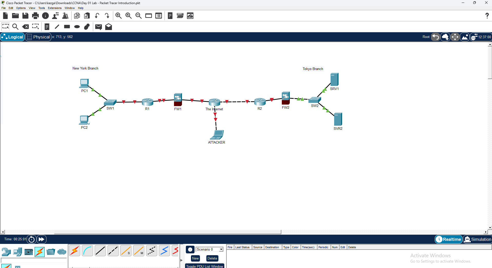

# CCNA Day 1 Lab – Network Topology Introduction in Cisco Packet Tracer

---

## Overview

This lab recreates the enterprise network topology introduced in **Jeremy's IT Lab CCNA Day 1** video. The diagram represents a two-branch corporate network — New York and Tokyo — connected through the internet, with firewalls protecting each branch, routers handling inter-branch routing, switches providing LAN connectivity, servers hosting branch resources, and an external attacker connected through the internet. All devices were placed and connected in **Cisco Packet Tracer** using the automatic connection type function.

---

## Environment

| Tool | Purpose |
|------|---------|
| Cisco Packet Tracer | Network simulation and topology design |
| Cisco 2911 Routers (x2) | Inter-branch and internet routing |
| Cisco 2960 Switches (x2) | LAN switching per branch |
| Cisco ASA 5505 Firewalls (x2) | Perimeter security per branch |
| PCs (x2) | Branch workstations |
| Servers (x2) | Branch servers |
| Laptop | External attacker simulation |
| GitHub | Documentation and version control |

---

## Network Topology Design

### Device Roles

| Device | Role | Branch |
|--------|------|--------|
| PC1 | Workstation | New York |
| PC2 | Workstation | New York |
| SW1 | LAN Switch | New York |
| R1 | Router | New York |
| FW1 | Firewall | New York |
| The Internet | Cloud / WAN | N/A |
| FW2 | Firewall | Tokyo |
| R2 | Router | Tokyo |
| SW2 | LAN Switch | Tokyo |
| SRV1 | Server | Tokyo |
| SRV2 | Server | Tokyo |
| ATTACKER | External Threat | Internet |

---

## Build Walkthrough

---

### ✅ Step 1 — Placed All Devices in the Topology

Opened Cisco Packet Tracer and placed all required devices in the logical workspace:

**New York Branch (left side):**
- 2x PCs (PC1, PC2)
- 1x Cisco 2960 Switch (SW1)
- 1x Cisco 2911 Router (R1)
- 1x Cisco ASA 5505 Firewall (FW1)

**Internet (center):**
- 1x Cloud device (The Internet)
- 1x Laptop (ATTACKER)

**Tokyo Branch (right side):**
- 1x Cisco ASA 5505 Firewall (FW2)
- 1x Cisco 2911 Router (R2)
- 1x Cisco 2960 Switch (SW2)
- 2x Servers (SRV1, SRV2)

---

### ✅ Step 2 — Connected All Devices

Used Packet Tracer's **Automatically Choose Connection Type** function to cable all devices together. Connected PCs to SW1, SW1 to R1, R1 to FW1, FW1 to The Internet cloud, The Internet to FW2, FW2 to R2, R2 to SW2, and SW2 to SRV1 and SRV2. Connected the ATTACKER laptop to The Internet cloud. Red link indicators on the firewall and router connections confirm interfaces are administratively down pending configuration — expected behavior at this stage.

---

### ✅ Step 3 — Verified Completed Topology

Confirmed the completed network diagram matches the Day 1 lab reference topology. Both branches are correctly positioned with all devices connected through the internet cloud. The ATTACKER laptop is correctly placed on the internet segment representing an external threat actor.

*CCNA Day 1 Lab — completed two-branch enterprise topology with New York and Tokyo branches, firewalls, routers, switches, servers, and external attacker*

---

## Skills Demonstrated

| Skill | How It Was Applied |
|-------|--------------------|
| Network Topology Design | Recreated a two-branch enterprise diagram from a reference |
| Device Placement | Correctly identified and placed routers, switches, firewalls, PCs, servers, and attacker |
| Device Selection | Selected correct Cisco models per lab specification |
| Cable Connections | Used automatic connection type to link all devices |
| Topology Reading | Interpreted a reference network diagram and reproduced it accurately |
| Cisco Packet Tracer | Navigated device library, logical workspace, and connection tools |

---

## Lessons Learned

**Reading a network diagram is a core networking skill.** Before configuring a single device, a network engineer must be able to look at a topology and understand what every device does, why it is placed where it is, and how traffic flows between components. This lab builds that foundational visual literacy.

**Firewalls sit between the router and the internet for a reason.** In both branches, the firewall is positioned between the internal router and the internet cloud. This is standard enterprise perimeter design — traffic from the internet hits the firewall before it ever reaches internal devices. Understanding device placement is as important as understanding device configuration.

**Red link indicators are not always errors.** The red triangles on firewall and router connections indicate interfaces that are administratively down — they have not been configured yet. Knowing the difference between a physical connection problem and an unconfigured interface is a basic but important troubleshooting distinction.

---

## 💼 Real-World Application

Every enterprise network starts with a topology diagram. Network engineers use diagrams like this one to plan deployments, document existing infrastructure, and communicate changes to stakeholders. Help desk engineers reference them during troubleshooting. Security analysts use them to understand traffic flow before investigating incidents. Being able to read, recreate, and eventually build on a network topology is a foundational skill required across networking, security, and cloud infrastructure roles.

---

## References

- [Jeremy's IT Lab — CCNA Day 1](https://www.youtube.com/watch?v=H8W9oMNSuwo)
- [Jeremy's IT Lab — Full CCNA Course](https://www.youtube.com/playlist?list=PLxbwE86jKRgMpuZuLBivzlM8s2Dk5lXBQ)
- [Cisco Packet Tracer Download](https://www.netacad.com/courses/packet-tracer)
- [Cisco 2911 Router Datasheet](https://www.cisco.com/c/en/us/products/routers/2911-integrated-services-router-isr/index.html)
